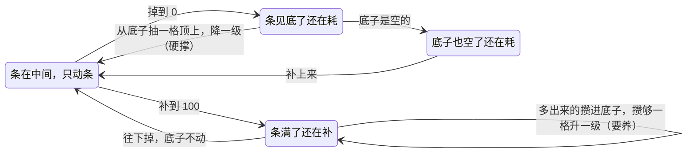
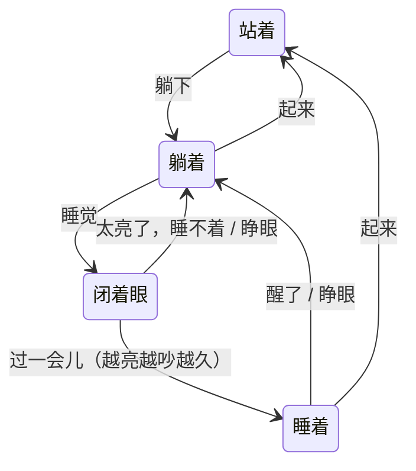
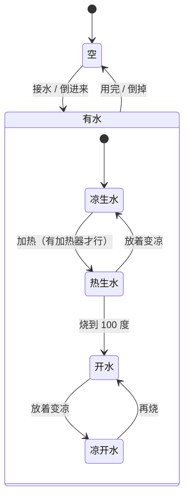
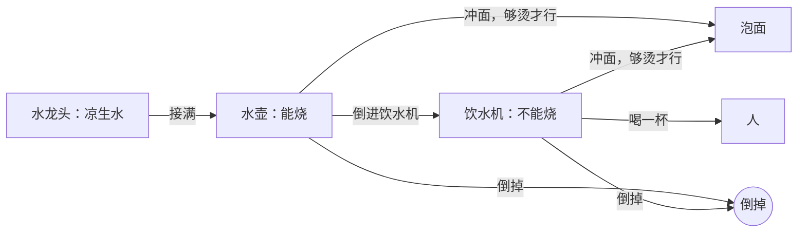
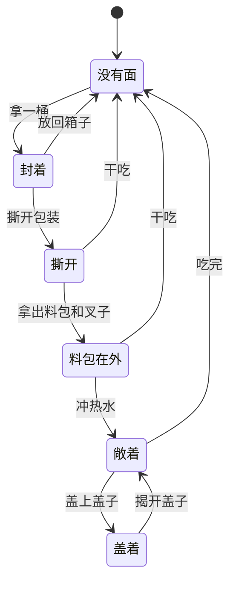

# 草图与状态机

这份文档画规则的骨架：有哪些状态、靠什么走到下一个状态。代码和数值都是暂时的假设，这里只留下要守住的形状。用它来找三种毛病：走进去出不来的死路、明明能做却要绕一圈的远路、说不通的跳变。

改规则时先改这里的图，再改代码。数值不写在这里，写在 `src/data/`。

## 一、有底子的条：要养，能透支

人要养，也能透支。这是两个性质，不绑定某种实现。现在用「底子」表达：条是上面那一截，底子是下面攒着的，按格算，格数就是等级。

- **要养。** 条满了还在补，不白补：多出来的一点点攒进底子。底子只在条满的时候长，所以攒得慢。
- **能透支。** 底子攒下了就留着，条往下掉时不动它；条见底了还在耗，才从底子里抽一格，条回到一格那么多，还能硬撑一阵。
- **底子也空了。** 再耗下去就伤到下一层，由别的条承担后果。
- **看得见。** 等级是条的粗细和颜色；条下面一道细线是正在攒的那一格。

| 条 | 底子是什么 | 底子空了还在耗 |
| --- | --- | --- |
| 精力 | 攒着的觉，满格是睡足 | 伤体能 |
| 心情 | 心死到幸福的五级（候选：底子就是幸福） | 暂无下一层 |
| 体能 | 身体的底子 | 以后是健康 |
| 体力、水分 | 没有底子 | 见底直接伤体能 |

几层连起来：体力、水分、精力是最上面一层；吃饱睡足时体能慢慢涨，满了攒进体能的底子；最上面一层透支时伤的也是体能。

**精力就是这条规则的例子。** 精力只有睡觉能补。满了接着睡，多出来的攒进底子；底子攒满了才会自然醒，没攒满（欠着觉）时天亮也叫不醒。通宵的第二天，条见底了就从底子里抽一格，回到「累了」那一带硬撑。熬几天也撑得住，因为底子只有见底时才动。养回来却要好几觉：每一夜只有条补满之后那几个小时在攒底子，没窗帘的房间天一亮就睡不沉。

以前的写法是「条补满就升一级，条掉回 70」。条会往下跳，满了之后也没有东西可攒，所以换成了底子。

**还没定：**

- 心情的底子是不是「幸福」：条（快乐）靠一次消费就能刷满，底子却只在满了之后慢慢攒、见底才掉。这可能正好回答「快乐和幸福怎么区分」。
- 体力要不要也有底子（胖瘦）。
- 现在只要吃饱，心情就能一路攒到 lv4（模拟里一周左右）。心情的稳定点放在哪一级还没定。

## 二、睡觉

- 闭着眼时还能看手机；睡着了身体被占住，别的物件都是灰的，手机拿不出来。
- 醒来的条件有四个：睡足了且天亮、房间太亮且不欠觉、躺够了上限、饿醒。欠着觉时光叫不醒人，但照样让人睡不沉。
- 灯开着想睡，要起来走到灯下关掉。这是代价，不是死路。

## 三、水和容器

每个容器里的水有三个量：多少、多热、有几成没烧开过。所有容器共用这套规则，倒来倒去时按水量混合。

- 饮水机里的水倒不回水壶，生水在饮水机里只有两条出路：喝下去（伤身体），或倒掉。
- 水壶烧坏了，就再也没有热水。首片接受这一点，买新的留给以后的切片。

## 四、泡面

- 冲上水之后有两个值：水值从冲水起每分钟涨，盖不盖都一样，涨满就坨了；热值只在盖着时涨，够了才熟。料包在「料包在外」和「敞着」时都能放。
- 敞着就能吃，没盖过就是硬的。开吃以后不能再盖回去，吃到一半走开，回来接着吃。
- 只有够烫的水冲得进来，冷水倒不进来。冲进去的水倒不出来：倒掉会把料包一起倒掉，那已经不是原来那桶面了，所以不做这一步。汤里有没烧开过的水，吃完扣体能，这是后果，不是死路。

## 找到的毛病

| 发现 | 处理 |
| --- | --- |
| 满了之后没有东西可攒，条补满升级后还往下跳 | 换成底子：满了多出来的攒进底子，见底才抽一格 |
| 饮水机里倒进了生水，只能一杯杯喝完 | 所有容器都能「把水倒掉」（开着加热时先关掉） |
| 冲了水不盖，要先盖上再揭开才能吃 | 揭开就回到「敞着」，敞着就能吃 |
| 拿出来的面放不回去，学会自动泡面后它还挡着 | 没拆的面能放回箱子 |
| 泡面里的生水要不要能倒掉 | 不做，原因见「泡面」 |
| 水壶烧坏了就没有热水 | 首片接受 |
| 撕开没泡的面挡着自动泡面 | 接受：手动泡完或干吃 |
